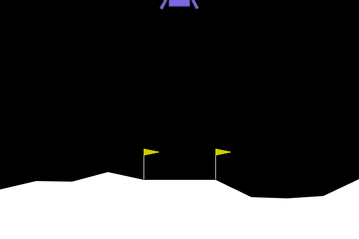
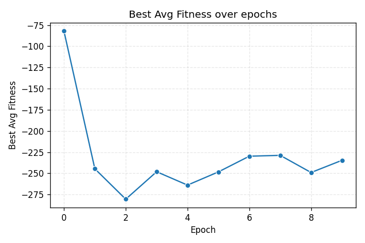
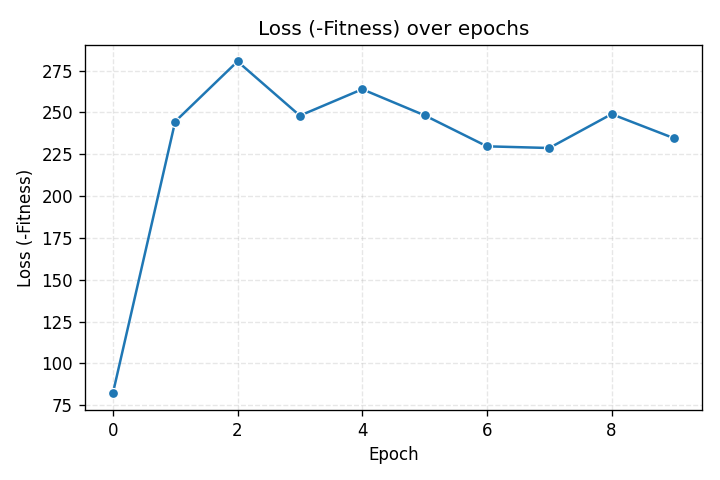

# ESP Neuroevolution — LunarLanderContinuous-v3

[](https://www.python.org/)
[](LICENSE)
[](https://gymnasium.farama.org/)

---

## Demo

<p align="center">
  
  <br><em>Network structure evolution over 150 epochs</em>
</p>

<p align="center">
  
  <br><em>Best agent landing (epoch 151)</em>
</p>

<p align="center">
  
  
</p>

---

## English

### Overview

Implementation of the **Enforced Sub-Populations (ESP)** neuroevolution algorithm applied to the continuous control task `LunarLanderContinuous-v3` from [Gymnasium](https://gymnasium.farama.org/).

ESP (Gomez & Miikkulainen, 1999) evolves neural network weights by maintaining a **separate sub-population for each hidden neuron**. Networks are assembled by sampling one individual from each sub-population, evaluated in the environment, and fitness is credited back to the participating individuals. This cooperative coevolution allows the algorithm to evolve RNNs for sequential decision-making tasks.

### Architecture

| File | Description |
|------|-------------|
| `esp.py` | `ESPPopulation` — core ESP algorithm: evaluation, selection/breeding, burst mutation, structural adaptation |
| `network.py` | `RecurrentNetwork` — Elman-style RNN: `h = tanh(W_ih·x + W_hh·h_prev)`, `out = tanh(W_ho·h)` |
| `esp_lander.py` | CLI entry point: `--train`, `--test`, `--visualize_structure` |
| `utils.py` | `save_network` / `load_network` (pickle) |
| `visualizations.py` | Network visualizer (coolwarm heatmap), training curve plotter |
| `test_esp.py` | 10 unit tests covering all 5 algorithm correctness fixes |

### Algorithm

1. **Evaluate** — each individual in each sub-population is assembled into a network with random partners and evaluated over several trials
2. **Select & Breed** — top 25% selected, 1-point crossover applied, Cauchy mutation perturbs the lower half (Algorithm 7.1)
3. **Burst Mutation** — if fitness stagnates, regenerate all sub-populations around the best individual (Algorithm 7.2)
4. **Structural Adaptation** — after two consecutive burst mutations, try removing each neuron; add one if none can be removed (Algorithm 7.3)

Genome format per individual: `[w_ih (input_size) | w_hh (hidden_size) | w_ho (output_size)]`

### Quick Start

```bash
# Create virtual environment and install dependencies
python -m venv .venv
.venv\Scripts\activate          # Windows
# source .venv/bin/activate     # Linux/macOS
pip install gymnasium[box2d] numpy matplotlib seaborn imageio

# Train (300 epochs, 12 hidden neurons, sub-population of 20)
python esp_lander.py --train --epochs 300 --hidden_size 12 --subpop_size 20 --trials_per_individual 5

# Test the saved model (opens render window)
python esp_lander.py --test --load_weights model.pkl --test_episodes 5

# Visualize network structure
python esp_lander.py --visualize_structure --load_weights model.pkl --outfile network.png
```

### Key Parameters

| Parameter | Default | Description |
|-----------|---------|-------------|
| `--hidden_size` | 12 | Number of hidden neurons / sub-populations |
| `--subpop_size` | 20 | Individuals per sub-population |
| `--trials_per_individual` | 10 | Evaluations per individual per epoch |
| `--alpha_cauchy` | 1.0 | Scale of Cauchy mutation |
| `--stagnation_b` | 20 | Stagnation window (epochs) |
| `--crossover_rate` | 0.5 | 1-point crossover probability |

### Results

Training over 150 epochs achieves fitness **≈ +200** (successful landing). Burst mutation effectively escapes local optima; structural adaptation experiments with network topology dynamically.

### Tests

```bash
pip install pytest
pytest test_esp.py -v
# 10 passed
```

---

## Русский

### Описание

Реализация алгоритма нейроэволюции **ESP (Enforced Sub-Populations)** для задачи непрерывного управления `LunarLanderContinuous-v3` из [Gymnasium](https://gymnasium.farama.org/).

В алгоритме ESP (Gomez & Miikkulainen, 1999) для каждого скрытого нейрона поддерживается **отдельная подпопуляция** хромосом. Сеть собирается из одного представителя каждой подпопуляции, оценивается в среде, а приспособленность засчитывается участвовавшим особям. Такой кооперативный коэволюционный подход позволяет эволюционировать рекуррентные сети для задач последовательного принятия решений.

### Архитектура

| Файл | Описание |
|------|----------|
| `esp.py` | `ESPPopulation` — ядро алгоритма: оценка, отбор/скрещивание, burst-мутация, адаптация структуры |
| `network.py` | `RecurrentNetwork` — рекуррентная сеть Элмана: `h = tanh(W_ih·x + W_hh·h_prev)`, `out = tanh(W_ho·h)` |
| `esp_lander.py` | CLI: режимы `--train`, `--test`, `--visualize_structure` |
| `utils.py` | Сохранение/загрузка модели (pickle) |
| `visualizations.py` | Визуализация структуры сети и кривых обучения |
| `test_esp.py` | 10 юнит-тестов, проверяющих корректность всех трёх алгоритмов |

### Алгоритм

1. **Оценка** — каждая особь каждой подпопуляции собирается в сеть со случайными партнёрами и проходит несколько испытаний
2. **Отбор и скрещивание** — лучшие 25% отбираются, применяется одноточечный кроссинговер, нижняя половина мутирует по Коши (Алг. 7.1)
3. **Burst-мутация** — при стагнации все подпопуляции пересоздаются вокруг лучшей особи (Алг. 7.2)
4. **Адаптация структуры** — после двух burst-мутаций подряд пробуется удаление каждого нейрона; если улучшений нет — добавляется новый (Алг. 7.3)

Формат генома: `[w_ih (input_size) | w_hh (hidden_size) | w_ho (output_size)]`

### Запуск

```bash
# Создать виртуальное окружение и установить зависимости
python -m venv .venv
.venv\Scripts\activate
pip install gymnasium[box2d] numpy matplotlib seaborn imageio

# Обучение
python esp_lander.py --train --epochs 300 --hidden_size 12 --subpop_size 20 --trials_per_individual 5

# Тест сохранённой модели (открывает окно рендера)
python esp_lander.py --test --load_weights model.pkl --test_episodes 5

# Визуализация структуры сети
python esp_lander.py --visualize_structure --load_weights model.pkl --outfile network.png
```

### Результаты

За 150 эпох обучения достигается приспособленность **≈ +200** (успешная посадка). Механизм burst-мутации успешно выводит популяцию из локальных оптимумов; адаптация структуры динамически изменяет топологию сети.

### Тесты

```bash
pip install pytest
pytest test_esp.py -v
# 10 passed
```

---

## References

- Gomez, F., & Miikkulainen, R. (1999). *Solving Non-Markovian Control Tasks with Neuroevolution*. IJCAI-99.
- [Gymnasium LunarLanderContinuous-v3](https://gymnasium.farama.org/environments/box2d/lunar_lander/)
